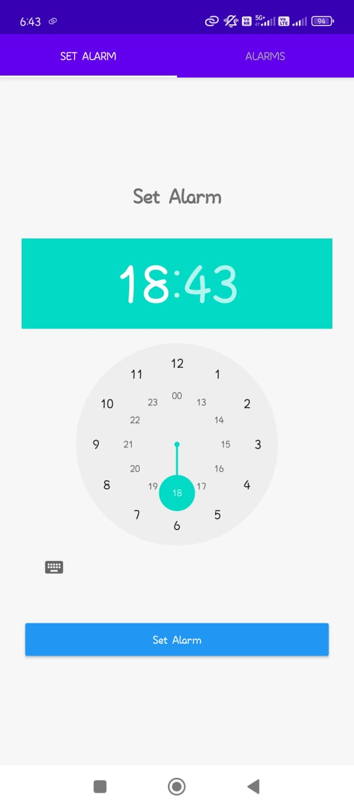
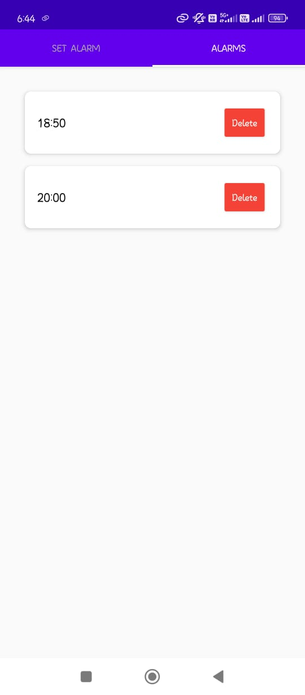

# AlarmApp ⏰

A simple Android alarm clock app built using **Android Studio** and **Java**.  
It provides a clean tab-based interface to set alarms and manage them efficiently, with built-in vibration feedback and proper permission handling — including special handling for MIUI devices.

---

## 🧠 Features
- 🕓 **Set Alarms Easily:** Create alarms using a simple and intuitive interface.  
- 📋 **View Existing Alarms:** Manage all your alarms in one place with a dedicated tab layout.  
- 🔔 **Vibration Feedback:** Provides a short vibration when the app launches to confirm responsiveness.  
- ⚙️ **MIUI Permission Support:** Automatically opens MIUI’s permission editor for better compatibility on Xiaomi devices.  
- 💡 **Modern UI:** Uses **TabLayout** and **ViewPager2** for a smooth tabbed experience.  
- 🧾 **Background Alarm Handling:** Supported by other activities and services like `AlarmService` and `AlarmReceiver`.

---

## 🛠️ Tech Stack
- **Language:** Java  
- **IDE:** Android Studio  
- **UI Components:**  
  - `TabLayout` and `ViewPager2` for navigation  
  - Material Design components for layout  
- **System Components:**  
  - `AlarmManager` (for alarm scheduling)  
  - `BroadcastReceiver` (for alarm triggers)  
  - `ForegroundService` (for alarm playback)  
- **Permissions Used:**  
  - `VIBRATE`  
  - `SCHEDULE_EXACT_ALARM`  
  - `WAKE_LOCK`  
  - `POST_NOTIFICATIONS`  
  - `FOREGROUND_SERVICE`  

---

## 📦 Installation
1. Download the latest APK from the [`/apk`](./apk) folder.  
2. Install it on your Android device (you might need to enable “Install from Unknown Sources”).  
3. Launch the app — you'll feel a short vibration when it starts!  
4. Use the **Set Alarm** tab to create an alarm, and view/manage it under the **Alarms** tab.  

---

## 📸 Screenshots

| Home Screen | Alarms Tab | Alarm Ringing Screen |
|--------------|-------------|----------------------|
|  |  |  |

## 📚 How It Works
1. The **MainActivity** hosts two tabs — one for setting alarms and another for viewing them.  
2. The **TabPagerAdapter** handles navigation between these tabs using `ViewPager2`.  
3. When the user sets an alarm, it's managed by the app's internal services (`AlarmService`, `AlarmReceiver`, etc.).  
4. The app vibrates briefly at startup and requests permissions if necessary.  
5. On MIUI devices, the app intelligently redirects users to MIUI's permission manager to ensure alarms run properly in the background.  
